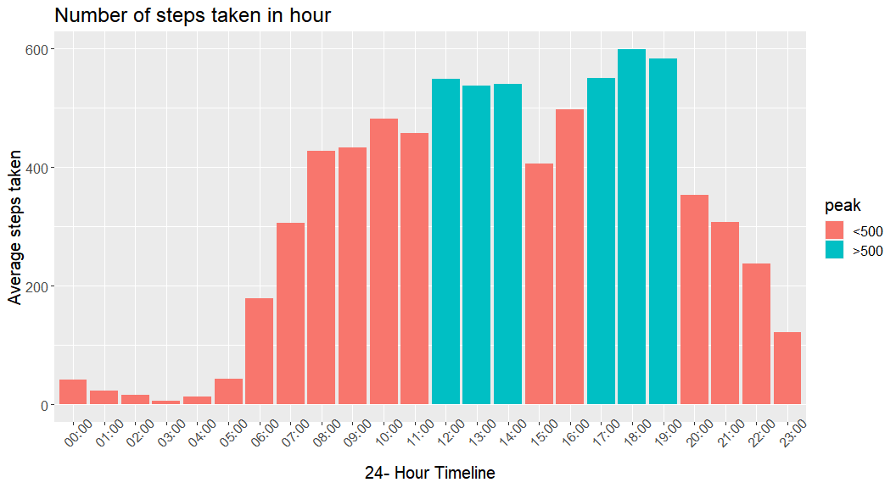
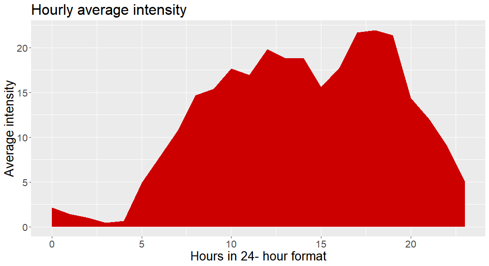
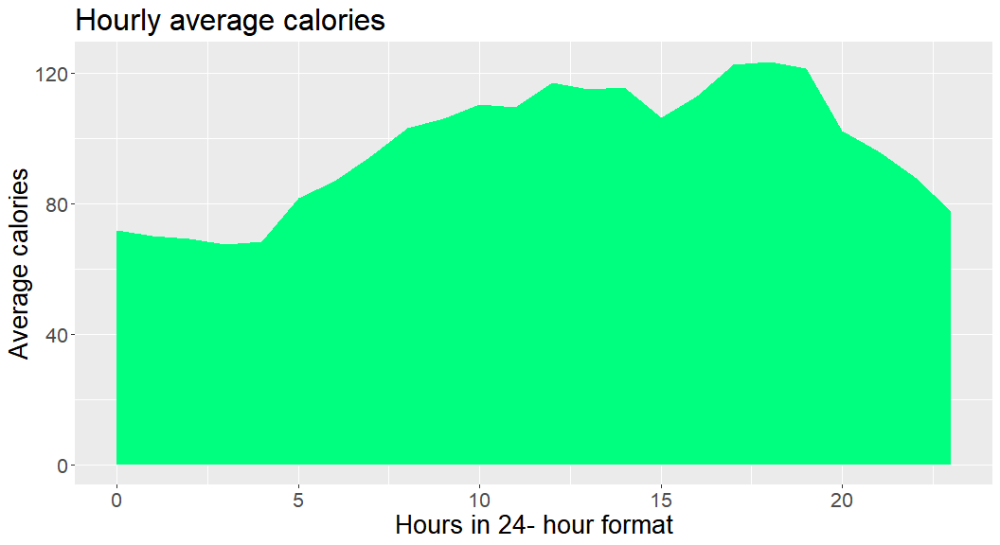
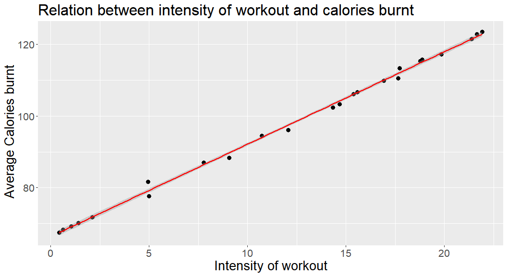
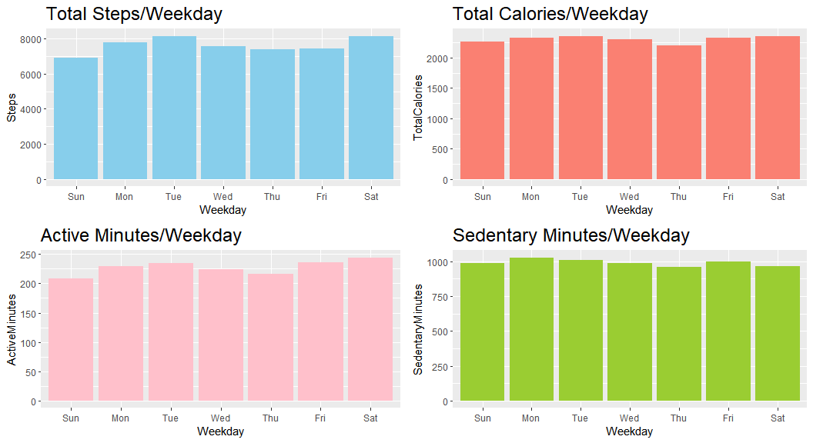

Bellabeat case study - Exploratory analysis
================

# Fitbit Exploratory Analysis

## Table of Contents

-   **1** Introduction
-   **2** Loading Libraries
-   **3** Importing datasets
-   **4** Understanding data
-   **5** Workout routine of induviduals
-   **6** Checking calories burnt and Intensity of workout to check
    correlation
-   **6.1** Importing datasets and visualizing individually
-   **6.2** Checking correlation between intensity and calories
-   **7** Summarizing the data per weekday
-   **8** Findings

# 1 - Introduction

#### About the company

**Bellabeat**, a high-tech manufacturer of health-focused products for
women. Bellabeat is a successful small company, but they have the
potential to become a larger player in the global smart device market.
Urška Sršen, cofounder and Chief Creative Officer of Bellabeat, believes
that analyzing smart device fitness data could help unlock new growth
opportunities for the company

#### Business task

Identify potential opportunities for growth and recommendations for the
Bellabeat marketing strategy improvement based on trends in smart device
usage.

#### Questions for the analysis

1.  What are some trends in smart device usage?
2.  How could these trends apply to Bellabeat customers?
3.  How could these trends help influence Bellabeat marketing strategy

#### Data used

-   Fitbit Fitness Tracker data
-   Source: <https://www.kaggle.com/arashnic/fitbit>
-   Background on the data: 33 users consented to use their minute-
    level data which was captured between 12-4-2016 to 12-05-2016.
-   User data is anonymous, taken from Amazon hence credible and
    authentic.

# 2 - Loading libraries

``` r
library(tidyverse)
## -- Attaching packages --------------------------------------- tidyverse 1.3.1 --
## v ggplot2 3.3.5     v purrr   0.3.4
## v tibble  3.1.6     v dplyr   1.0.8
## v tidyr   1.2.0     v stringr 1.4.0
## v readr   2.1.2     v forcats 0.5.1
## -- Conflicts ------------------------------------------ tidyverse_conflicts() --
## x dplyr::filter() masks stats::filter()
## x dplyr::lag()    masks stats::lag()
library(lubridate)
## 
## Attaching package: 'lubridate'
## The following objects are masked from 'package:base':
## 
##     date, intersect, setdiff, union
library(skimr)
library(sqldf)
## Loading required package: gsubfn
## Loading required package: proto
## Loading required package: RSQLite
library(ggpubr)
```

# 3 - Importing Dataset

importing fitbit data which has been downloaded from
[click](https://www.kaggle.com/arashnic/fitbit)

``` r
daily_activity <- read.csv("dailyActivity_merged.csv")
calories <- read.csv("hourlyCalories_merged.csv")
intensities <- read.csv("hourlyIntensities_merged.csv")
sleep <- read.csv("sleepDay_merged.csv")
weight <- read.csv("weightLogInfo_merged.csv")
steps <- read.csv("corrected_steps_1.csv")
```

# 4 - Understanding data

I just need to make sure that everything were imported correctly by
using View() and head() functions.

``` r
knitr :: kable(head(daily_activity [ , 1:15]),'simple')
```

|         Id | ActivityDate | TotalSteps | TotalDistance | TrackerDistance | LoggedActivitiesDistance | VeryActiveDistance | ModeratelyActiveDistance | LightActiveDistance | SedentaryActiveDistance | VeryActiveMinutes | FairlyActiveMinutes | LightlyActiveMinutes | SedentaryMinutes | Calories |
|-----------:|:-------------|-----------:|--------------:|----------------:|-------------------------:|-------------------:|-------------------------:|--------------------:|------------------------:|------------------:|--------------------:|---------------------:|-----------------:|---------:|
| 1503960366 | 4/12/2016    |      13162 |          8.50 |            8.50 |                        0 |               1.88 |                     0.55 |                6.06 |                       0 |                25 |                  13 |                  328 |              728 |     1985 |
| 1503960366 | 4/13/2016    |      10735 |          6.97 |            6.97 |                        0 |               1.57 |                     0.69 |                4.71 |                       0 |                21 |                  19 |                  217 |              776 |     1797 |
| 1503960366 | 4/14/2016    |      10460 |          6.74 |            6.74 |                        0 |               2.44 |                     0.40 |                3.91 |                       0 |                30 |                  11 |                  181 |             1218 |     1776 |
| 1503960366 | 4/15/2016    |       9762 |          6.28 |            6.28 |                        0 |               2.14 |                     1.26 |                2.83 |                       0 |                29 |                  34 |                  209 |              726 |     1745 |
| 1503960366 | 4/16/2016    |      12669 |          8.16 |            8.16 |                        0 |               2.71 |                     0.41 |                5.04 |                       0 |                36 |                  10 |                  221 |              773 |     1863 |
| 1503960366 | 4/17/2016    |       9705 |          6.48 |            6.48 |                        0 |               3.19 |                     0.78 |                2.51 |                       0 |                38 |                  20 |                  164 |              539 |     1728 |

``` r
n_distinct(daily_activity$Id)
## [1] 33
n_distinct(calories$Id)
## [1] 33
n_distinct(intensities$Id)
## [1] 33
n_distinct(sleep$Id)
## [1] 24
n_distinct(weight$Id)
## [1] 8
```

##### This information tells us about number participants in each data sets.

-   There is 33 participants in the activity, calories and intensities
    data sets
-   24 in the sleep
-   only 8 in the weight data set. 8 participants is not significant to
    make any recommendations and conclusions based on this data.

### check for duplicates

``` r
sum(duplicated(daily_activity))
## [1] 0
sum(duplicated(calories))
## [1] 0
sum(duplicated(intensities))
## [1] 0
sum(duplicated(sleep))
## [1] 3
sum(duplicated(weight))
## [1] 0
```

#### remove duplicates

``` r
sleep <-  distinct(sleep)
sum(duplicated(sleep))
## [1] 0
```

### Summary of Data

``` r
# activity
daily_activity %>%  
  select(TotalSteps,
         TotalDistance,
         SedentaryMinutes, Calories) %>%
  summary()
##    TotalSteps    TotalDistance    SedentaryMinutes    Calories   
##  Min.   :    0   Min.   : 0.000   Min.   :   0.0   Min.   :   0  
##  1st Qu.: 3790   1st Qu.: 2.620   1st Qu.: 729.8   1st Qu.:1828  
##  Median : 7406   Median : 5.245   Median :1057.5   Median :2134  
##  Mean   : 7638   Mean   : 5.490   Mean   : 991.2   Mean   :2304  
##  3rd Qu.:10727   3rd Qu.: 7.713   3rd Qu.:1229.5   3rd Qu.:2793  
##  Max.   :36019   Max.   :28.030   Max.   :1440.0   Max.   :4900


# calories
calories %>%
  select(Calories) %>%
  summary()
##     Calories     
##  Min.   : 42.00  
##  1st Qu.: 63.00  
##  Median : 83.00  
##  Mean   : 97.39  
##  3rd Qu.:108.00  
##  Max.   :948.00
# sleep
sleep %>%
  select(TotalSleepRecords, TotalMinutesAsleep, TotalTimeInBed) %>%
  summary()
##  TotalSleepRecords TotalMinutesAsleep TotalTimeInBed 
##  Min.   :1.00      Min.   : 58.0      Min.   : 61.0  
##  1st Qu.:1.00      1st Qu.:361.0      1st Qu.:403.8  
##  Median :1.00      Median :432.5      Median :463.0  
##  Mean   :1.12      Mean   :419.2      Mean   :458.5  
##  3rd Qu.:1.00      3rd Qu.:490.0      3rd Qu.:526.0  
##  Max.   :3.00      Max.   :796.0      Max.   :961.0
# weight
weight %>%
  select(WeightKg, BMI) %>%
  summary()
##     WeightKg           BMI       
##  Min.   : 52.60   Min.   :21.45  
##  1st Qu.: 61.40   1st Qu.:23.96  
##  Median : 62.50   Median :24.39  
##  Mean   : 72.04   Mean   :25.19  
##  3rd Qu.: 85.05   3rd Qu.:25.56  
##  Max.   :133.50   Max.   :47.54
```

### discoveries from data summary

-   From the above summary of daily activity, we understand that Avg
    steps taken were 7638 whereas the recommended steps are 10,000 steps
-   Average sedentary time is 991 minutes (i.e) 16 hours, that is very
    high and should be reduced.
-   Averege sleeping time is 7 hours. as per WHO for an adult sleeping
    time of 7 or more helps for good health

# 5 - Workout routine of induviduals

``` r
# creating a new column which shows whether average steps of the particular hour is more than 500 or not

steps <- steps %>% mutate(peak = ifelse(average.steps >500, '>500','<500'))
```

``` r
# crating a histogram to analyze average steps taken against hour of the day

ggplot(data = steps)+geom_col(mapping = aes(x = time, y= average.steps, fill =peak)) + labs(title= "Number of steps taken in hour", x= "24- Hour Timeline",y= "Average steps taken")+theme(text = element_text(size=15) , axis.text.x = element_text(angle=45))
```

<!-- -->

#### Summary for the plot

-   The above graph shows the number of steps taken on average by all 33
    users from 00:00 hrs to 23:00 hrs
-   We find that the users have been very active between 08:00AM and
    07:00PM which is the working hours
-   It has peaked to 500- 600 steps during lunch-time(12:00PM- 02:00PM)
    and evening time(05:00PM- 07:00PM).
-   The average steps between morning transportation and evening
    transportation varies because normally, we go straight to office at
    morning but do errands like shopping when returning home

# 6 Checking calories burnt and Intensity of workout to check correlation

we are going to use hourly intensity dataset and hourly calories dataset
for this section. This dataset contains hourly observation for all 33
users individually. Hence we are manipulating data in Excel before
importing here.

Data manipulation in Excel- Before we import the datasets, we are going
to merge and manipulate the dataset to get the hourly summary of average
intensity and calories for all 33 users.

### 6.1 Importing datasets and visualizing individually

``` r
calorie_intensity <- read.csv("calorie_intensity.csv")

head(calorie_intensity)
##   X hour mean_total_intensity mean_averageintensity mean_calories
## 1 1    0                 2.13                  0.04          71.8
## 2 2    1                 1.42                  0.02          70.2
## 3 3    2                 1.04                  0.02          69.2
## 4 4    3                 0.44                  0.01          67.5
## 5 5    4                 0.63                  0.01          68.3
## 6 6    5                 4.95                  0.08          81.7

ggplot(calorie_intensity ) + geom_area(mapping = aes(x= hour, y= mean_total_intensity),fill= "red3") + theme(text = element_text(size=20)) + labs(title= "Hourly average intensity", x= "Hours in 24- hour format", y= "Average intensity")
## Warning: Removed 1 rows containing missing values (position_stack).
```

<!-- -->

``` r
ggplot(calorie_intensity) + geom_area(mapping = aes(x= hour, y= mean_calories),fill= "springgreen1") + theme(text = element_text(size=20)) + 
    labs(title= "Hourly average calories", x= "Hours in 24- hour format", y= "Average calories")
## Warning: Removed 1 rows containing missing values (position_stack).
```

<!-- -->

### 6.2 Checking correlation between intensity and calories

``` r
ggplot(calorie_intensity, aes(x= mean_total_intensity, y= mean_calories)) + 
geom_point(size= 3, color= "black") + geom_smooth( ,method= 'lm', color= "red") + 
labs(title= "Relation between intensity of workout and calories burnt", x= "Intensity of workout", y= " Average Calories burnt") + theme(text = element_text(size=20))
## `geom_smooth()` using formula 'y ~ x'
## Warning: Removed 1 rows containing non-finite values (stat_smooth).
## Warning: Removed 1 rows containing missing values (geom_point).
```

<!-- --> \# 7 - Summarizing the
data per weekday to see if we can find any correlations.

``` r
daily_activity <- daily_activity %>% 
  mutate(TotalActiveMinutes = VeryActiveMinutes + FairlyActiveMinutes + LightlyActiveMinutes, 
         Weekday = weekdays(ActivityDate))


dailySummary <- daily_activity %>% 
  group_by(Weekday) %>% 
  summarise(Steps = mean(TotalSteps), Distance = mean(TotalDistance), 
            ActiveMinutes = mean(TotalActiveMinutes), SedentaryMinutes = mean(SedentaryMinutes), TotalCalories = mean(Calories)) 
```

``` r
ggarrange(
  dailySummary %>% 
    ggplot(aes(x = Weekday, y = Steps)) +
    geom_col(fill = "skyblue")+
    labs(title = "Total Steps/Weekday")+
    theme(plot.title = element_text(size = 18)),
  
  dailySummary %>% 
    ggplot(aes(x = Weekday, y = TotalCalories)) +
    geom_col(fill = "salmon")+
    labs(title = "Total Calories/Weekday")+
    theme(plot.title = element_text(size = 18)),
  
  dailySummary %>% 
    ggplot(aes(x = Weekday, y = ActiveMinutes)) +
    geom_col(fill = "pink")+
    labs(title = "Active Minutes/Weekday")+
    theme(plot.title = element_text(size = 18)),
  
  dailySummary %>% 
    ggplot(aes(x = Weekday, y = SedentaryMinutes)) +
    geom_col(fill = "olivedrab3")+
    labs(title = "Sedentary Minutes/Weekday")+
    theme(plot.title = element_text(size = 18)),
  
  widths = c(14,14)
  
)
```

<!-- -->

# 8 - Findings:

-   The data though extensive lacked some key characteristics like age
    and gender,which would have helped us narrow down more specific
    conclusions.
-   There is a direct correlation between Steps Taken, Active Minutes to
    Calories Burnt.
-   Evening (5PM -7PM) is the time where the maximum calories are burnt.
    It could mean the users workout after their office/schools/chores
    hours.
-   Hourly average intensity is more at daytime when compared to
    sedentary time.
-   Average calorie burnt at daytime is more than approx 50% more when
    compared to night time.
-   Total calories burnt and total steps during weekends and weekdays
    don’t have much difference, probable users must be performing
    similar activities during weekends.
